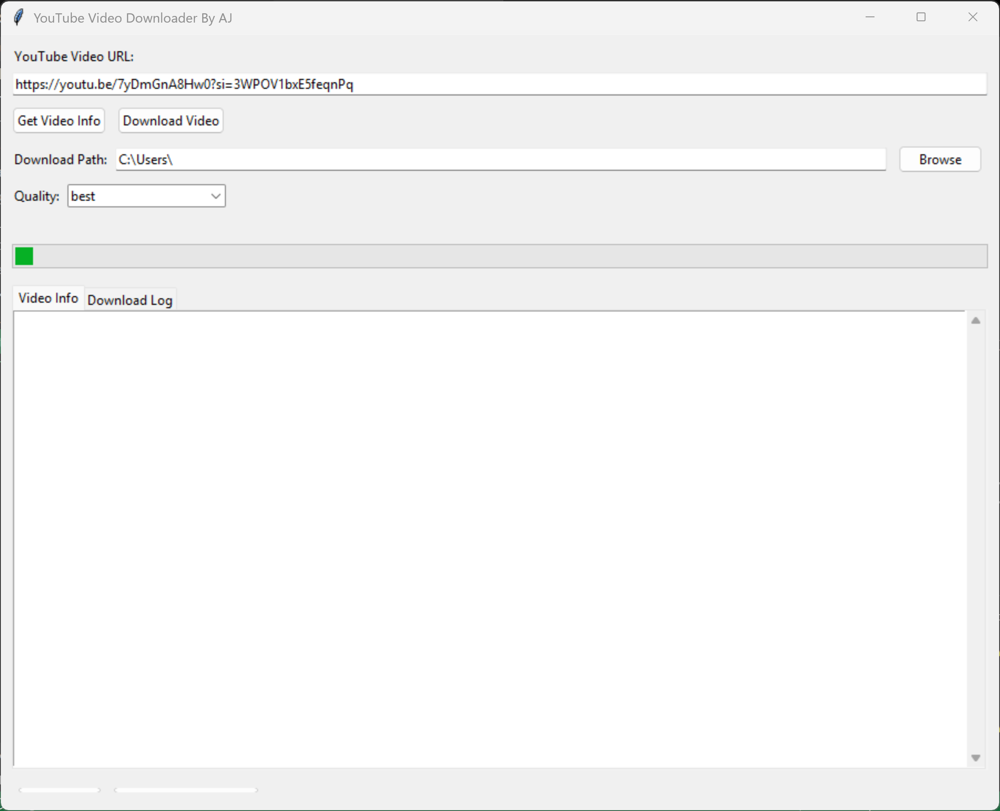

  
  

> ⚡ Download and analyze YouTube videos with a powerful, beginner-friendly Python desktop app. Built for students, content creators, and researchers.

---

## 🧾 About This Project

**YouTube Video Downloader** is a lightweight desktop application that allows users to:

- Extract video metadata (title, views, channel name, publish date)
- Download videos in MP4
- Use an intuitive GUI for fast, focused YouTube data work

> Designed to make YouTube content extraction practical, ethical, and useful for academic and professional use.

---

## 🎓 Academic Context

This project was created as part of **Advanced Python Programming * at **Bunker Hill Community College (BHCC)**.

### Educational Objectives:
- Practice modular Python design
- Build interactive GUI apps with real-world relevance
- Apply responsible coding for data access and automation
- Reflect on the social impact of media analysis tools

---

## 🔽 Download

📦 Latest release:  
➡️ [**Download Windows App (.exe)**](https://github.com/jentimanatol/MediaToolkitApp/releases/latest)

💻 Developer access:  
🔍 [**Browse Source Code & Releases**](https://github.com/jentimanatol/MediaToolkitApp/releases)

---

## 🚀 Key Features

- 🔍 **Analyze** YouTube metadata (title, views, likes, duration)
- 🧰 **Error handling** for invalid links or unavailable content
- 🖼️ **User-friendly GUI** powered by `tkinter`

## 🧑‍💼 Who It's For

This tool is ideal for:

| User Type         | Use Case                                      |
|------------------|-----------------------------------------------|
| 🎓 Students       | Analyze content for classwork and research    |
| 📊 Researchers    | Archive metadata for study or reporting       |
| 🎬 Creators       | Monitor video performance and details         |
| 🗂 Archivists     | Organize channel or content libraries         |

---

## 🖼️ App Interface

  
  

*A polished, minimal interface for accessible media analysis.*

---

## 💡 Why I Built This

YouTube holds massive educational and cultural value — but structured extraction of information is often frustrating. I built this app to:

- Automate metadata retrieval
- Simplify downloading in ethical, user-controlled ways
- Offer a clean alternative to ad-ridden tools

This reflects my interests in:

- 📊 Data analysis  
- 🧩 Problem-solving with Python  
- 🧠 Media studies & information accessibility  
- 💻 GUI design and digital literacy

---

## 🛠 Tech Stack

- `Python 3.11+`  
- `pytube` – for metadata & downloads  
- `tkinter` – GUI interface  
- `pydub` – (optional) audio conversion  
- `threading`, `datetime`, `os` – core functionality  
- `pyinstaller` – for .exe packaging  
- `matplotlib` – (optional) visual stats  

---

## 📄 License & Credits

- 🆓 **MIT License** — free to use, modify, and distribute  
- 👤 Created by **Anatolie Jentimir**  
- 🎓 Project for **Advanced Python @ BHCC**  
- 📅 Spring 2025  

---

> 💬 If this project helped you or sparked ideas, feel free to share your thoughts, submit issues, or contribute to the repository.  
> 🙌 Collaboration and feedback are always welcome!
"""

## ⚠️ Legal & Ethical Disclaimer

> This application is intended for **educational and personal research purposes only**. It does not support or encourage the unauthorized downloading, redistribution, or commercial use of copyrighted YouTube content.
>
> YouTube’s [Terms of Service](https://www.youtube.com/t/terms) prohibit downloading content unless explicitly permitted via a download button or feature provided by YouTube.
>
> 🛑 **Use this tool responsibly and at your own risk.**
> The developer is not liable for misuse of the software.

